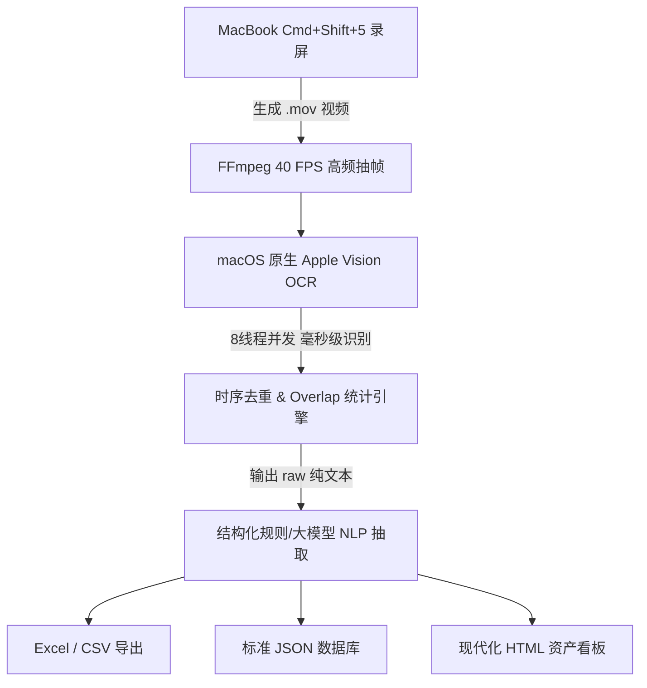

# 微信通讯录视频录屏提取与智能 CRM 看板构建技能

本技能提供了一套**完全无需系统辅助功能权限、零封号风险、本地纯离线**的个人微信海量通讯录提取与资产化方案。

通过 macOS 自带录屏快捷键（`Cmd + Shift + 5`）录制联系人列表平稳滑动视频，结合高帧率抽帧、Apple Vision 硬件加速 OCR 与多维实体解析，可在 30 秒内完整提取 5000+ 联系人并生成交互式 CRM 看板。

---

## 1. 核心架构与工作流



---

## 2. 命名提取模型与打标习惯建议 (Naming Schema & Best Practices)

本技能的结构化深度依赖于用户日常对微信好友的打标与备注习惯。推荐的最佳实践范式为：

$$\text{好友备注} = [\text{微信名/称谓}] + [\text{职位/头衔/机构/学校}] + [\text{场景/场地/活动/商圈}] + [\text{时间/年份}]$$

### 提取维度：
- **微信名 / 核心称呼**：如 `张三`, `李四`, `Alex`。
- **职位 / 头衔 / 机构**：如 `合伙人`, `架构师`, `某某大学`, `某某科技` 等。
- **场景 / 场地 / 圈子**：如 `某某峰会`, `某某沙龙`, `某某商圈`, `某某酒店`。
- **城市 / 地区**：支持一线城市、主要省会与全球核心枢纽。
- **时间 / 年份**：支持 4 位年份（如 `2023`, `2024`）。
- **行业归类**：自动映射至 `金融/投资`, `科技/互联网/AI`, `法律/法务/咨询`, `高校/科研/教育`, `医疗/健康`, `文化/传媒/消费` 等。

> 💡 **给用户的打标建议**：
> 微信本身缺乏多维标签系统，日常在备注中顺手记录「认识地点与年份」，不仅便于日常搜索唤醒人脉，也能在批量建档时最大化发挥数据资产价值。

---

## 3. 实测数据与录屏滑动速度指南

在 5000+ 联系人库上的真实基准测试数据：

| 录屏时长 | 提取帧数 (@40-50 FPS) | 捕获联系人数 | 覆盖率 | 相邻帧平均重叠人数 | 适用场景 |
| :--- | :--- | :--- | :--- | :--- | :--- |
| **5 秒快速录制** | 248 帧 | 1,607 人 | ~30% | 3.2 人 | 快速抽样/测试连通性 |
| **20 秒平稳录制** | 798 帧 | 4,389 人 | **81.7%** | 4.1 人 | 日常快速全量备份 |
| **30~40 秒匀速录制** (推荐) | ~1400 帧 | 5,000+ 人 | **>95%** | 8~12 人 | **全量无损建档 (推荐)** |

> 💡 **最佳录制建议**：
> 用双指在 Mac 触控板上从 A 到 Z 匀速轻推下滑，耗时约 **30 秒** 即可达到极高重叠率（>60%），做到 0 跳帧、无死角覆盖。

---

## 4. 命令行执行指引

### 步骤 1：录制视频
按下 `Command + Shift + 5`，框选桌面微信联系人列表区域，点击录制，匀速下滑至底部后停止，保存为 `wechat_contacts.mov`。

### 步骤 2：从视频提取联系人
```bash
python scripts/process_video.py wechat_contacts.mov --output data/contacts_raw.txt --fps 40.0
```

### 步骤 3：一键结构化并生成看板
```bash
python scripts/structure_contacts.py data/contacts_raw.txt --csv data/contacts.csv --html data/contacts_crm.html
```

*(可选) 如需使用自定义场景词表或企业词表：*
```bash
python scripts/structure_contacts.py data/contacts_raw.txt --config config.example.json --html data/contacts_crm.html
```

---

## 5. 依赖环境

- **macOS**：macOS 12.0+ (原生内置 Vision.framework，无需额外安装 OCR 库)
- **Swift 编译器**：macOS 自带 `swiftc`（Xcode Command Line Tools）
- **FFmpeg**：`brew install ffmpeg`
- **Python**：Python 3.9+
